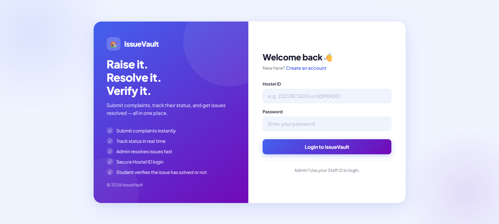
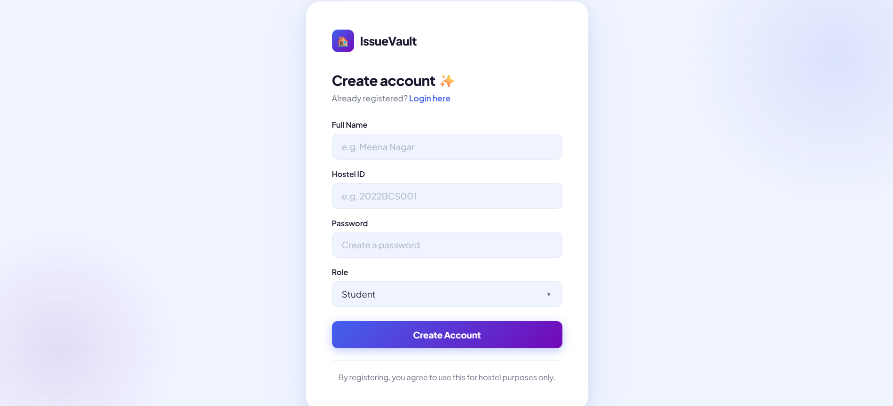
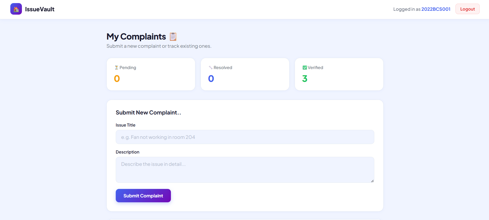
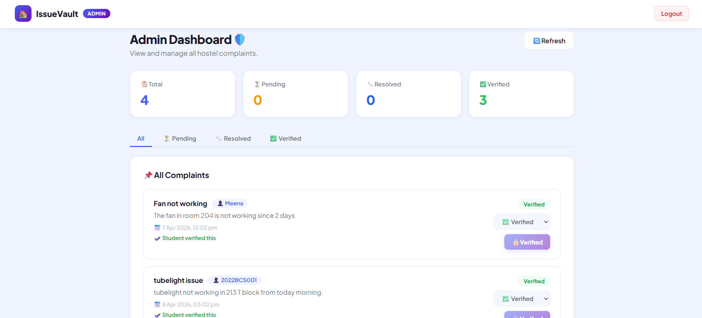
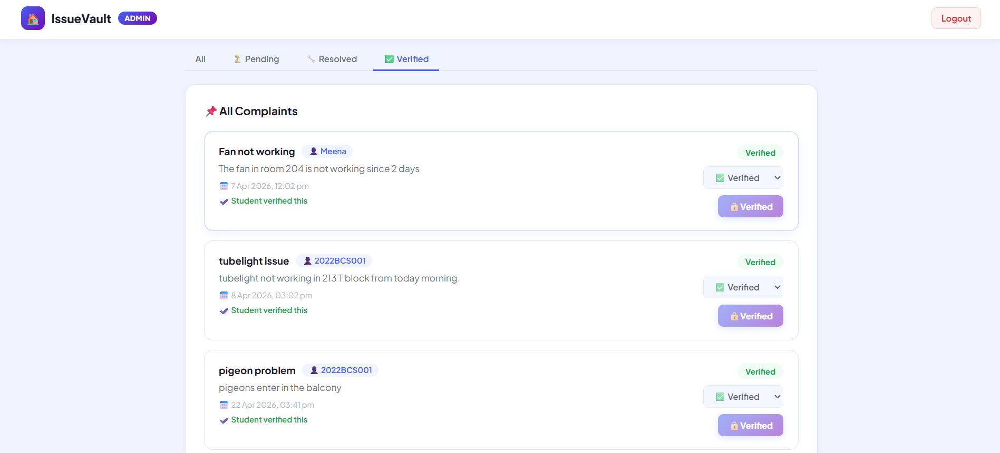

# IssueVault – Hostel Issue Reporting and Monitoring System

## Project Overview

IssueVault is a web-based Hostel Issue Reporting and Monitoring System developed to simplify the process of reporting, tracking, and resolving hostel-related issues within institutions or hostels.

The platform provides students with a centralized system to submit complaints digitally and monitor their progress, while administrators can efficiently manage complaints and update their status. The system improves transparency, accountability, and communication between users and administrators by replacing traditional manual complaint handling processes.

A unique feature of IssueVault is the complaint verification mechanism, where students confirm whether their issue has been resolved before the complaint is permanently closed and locked. This ensures accountability and prevents unresolved complaints from being marked complete.

---

# Objectives

The main objectives of IssueVault are:

- Digitize hostel complaint reporting
- Reduce delays in issue resolution
- Improve transparency in complaint handling
- Enable complaint status tracking
- Provide an efficient monitoring system for administrators
- Maintain complaint history and verification

---

# Technology Stack and Tools Used

## Frontend Technologies

- HTML5 → Structure of web pages
- CSS3 → Styling and responsive interface
- JavaScript → Client-side validation and interactivity

## Backend Technologies

- Node.js → Server-side runtime environment
- Express.js → Routing and API handling

## Database

- MongoDB → NoSQL database for storing users and complaint data

## Development Tools

- Visual Studio Code → Code editor
- MongoDB Compass → Database visualization and management
- Postman → API testing
- Google Chrome → Application testing
- Git & GitHub → Version control and repository management

---

# Features and Functionalities Implemented

## Authentication Module

Implemented:

✔ User Registration  
✔ User Login  
✔ Credential Validation  
✔ Authentication Handling  

Purpose:

Allows secure access to the system by validating users before granting functionality access.

---

## Complaint Management Module

Implemented:

✔ Submit complaints  
✔ Complaint title & description input  
✔ Timestamp generation  
✔ Input validation  
✔ Complaint storage in database  

Purpose:

Allows students/users to report issues efficiently.

---

## Complaint Tracking Module

Implemented:

✔ Track complaint status  
✔ Pending → Resolved → Verified workflow  
✔ Complaint history monitoring  

Purpose:

Users can continuously monitor issue progress.

---

## Admin Dashboard

Implemented:

✔ View all complaints  
✔ Update complaint status  
✔ Monitor pending complaints  
✔ Manage complaint workflow  

Purpose:

Provides administrators with centralized complaint management.

---

## Verification Module

Implemented:

✔ Student verifies issue resolution  
✔ Complaint status updated to Verified  
✔ Complaint locked after final confirmation  

Purpose:

Ensures transparency and prevents repeated modifications.

---

## Database Management

Implemented:

✔ Store user data  
✔ Store complaint data  
✔ Retrieve complaint records  
✔ Update complaint status  

Purpose:

Maintains structured and persistent storage.

---

# System Workflow

```text
User Login/Register
        ↓
Submit Complaint
        ↓
Complaint Stored in Database
        ↓
Admin Reviews Complaint
        ↓
Admin Updates Status
        ↓
User Verifies Resolution
        ↓
Complaint Locked
```

---


# Project Structure

```bash
issuevault-backend/           
│
├── config/
│   └── db.js                 
│
├── models/
│   ├── User.js                
│   └── complaint.js        
│
├── routes/
│   ├── authRoutes.js         
│   └── complaintRoutes.js    
│
├── controllers/
│   ├── authController.js      
│   └── complaintController.js 
│
├── middleware/
│   └── authMiddleware.js   
│
├── public/
│   ├── student.html           
│   ├── register.html        
│   ├── admin.html             
│   └── login.html            
│                      
├── server.js                  
├── package.json                     
```

---

# Installation / Execution Steps

## Prerequisites

Install:

- Node.js
- MongoDB
- Git
- Visual Studio Code

---

## Step 1: Clone Repository

```bash
git clone https://github.com/Meena-Nagar08/IssueVault
```

Move to project directory:

```bash
cd IssueVault
```

---

## Step 2: Install Dependencies

Run:

```bash
npm install
```

---

## Step 3: Configure Environment Variables

Create:

```env
.env
```

Example:

```env
PORT=5000
MONGO_URI=your_database_url
JWT_SECRET=your_secret_key
```

---

## Step 4: Start MongoDB

Ensure MongoDB server is running.

---

## Step 5: Run Backend Server

Execute:

```bash
node server.js
```

or

```bash
npm start
```

---

## Step 6: Open Application

Visit:

```bash
http://localhost:5000
```

Application should start successfully.

---

# User Roles

## Student/User

Can:

- Register/Login
- Submit complaints
- Track complaint status
- Verify complaint resolution

---

## Administrator

Can:

- Login
- View complaints
- Update complaint status
- Monitor complaints
- Manage issue workflow

---

# Developer / Project Owner

| Name | Contribution |
|------|---------------|
| **Meena** | Full Stack Development, System Design, Database Design, Documentation, Testing & Validation |

---

## Individual Contributions

This project was independently developed and documented.

Work completed individually:

✔ Requirement Analysis (SRS)  
✔ Software Design Specification (SDS)  
✔ Synopsis Preparation  
✔ Project Report Documentation  
✔ Database Design  
✔ System Architecture Design  
✔ Frontend Development  
✔ Backend Development  
✔ MongoDB Integration  
✔ Testing and Validation  
✔ Diagram Design (ER, DFD, Sequence, Flowchart, etc.)  
✔ Complaint Management Module  
✔ Authentication Module  
✔ Deployment Preparation  

**Project Type:** Individual Academic Project

---

# Screenshots / Output

### Login Page


Secure authentication page for users and administrators.



---

### Registration Page


Allows new users to create accounts.



---

### Complaint Submission Page


Users submit issues with title and description.



---

### Admin Dashboard


Administrator monitors complaints and updates status.



---

### Complaint Status Tracking Page


Users track complaint progress.



---

# Testing

Testing performed:

✔ Unit Testing  
✔ Integration Testing  
✔ System Testing  
✔ Validation Testing  

Example test cases:

| Test Case | Expected Result |
|-----------|----------------|
| Valid Login | Access Granted |
| Invalid Login | Error Message |
| Submit Complaint | Stored Successfully |
| Empty Complaint | Validation Error |
| Update Status | Status Updated |

---

# Future Enhancements

Possible future improvements:

- Real-time notifications
- Role-based access control
- Image upload support
- Mobile application
- Analytics dashboard
- Email notifications
- Complaint priority levels

---

# Conclusion

IssueVault successfully provides a digital platform for hostel issue reporting and monitoring. The system improves communication between users and administrators, ensures transparency in complaint tracking, reduces manual effort, and increases efficiency in issue resolution.

The project demonstrates full-stack web development concepts including frontend development, backend development, database integration, authentication, and software documentation.

---

# Author

Developed independently by:

**Meena**  
Engineering Student  
Full Stack Web Development Learner  

Academic Project – IssueVault Hostel Issue Reporting & Monitoring System
